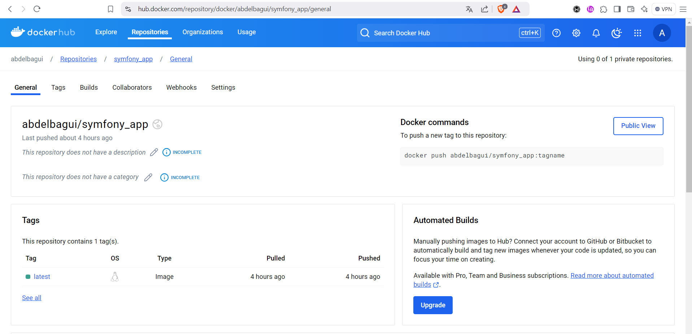
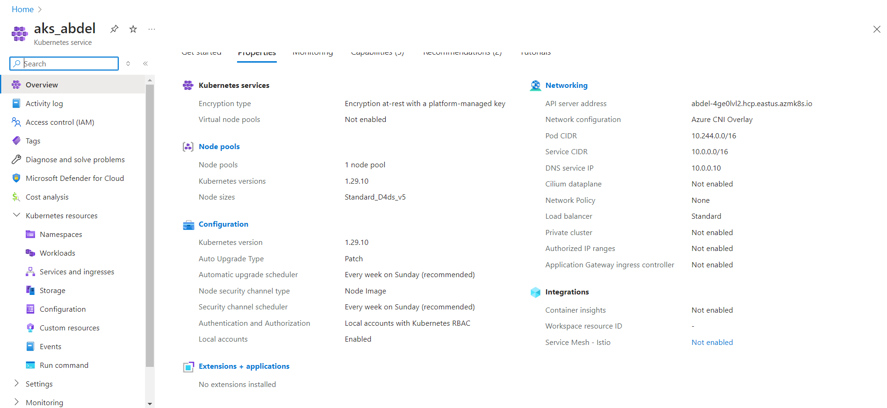
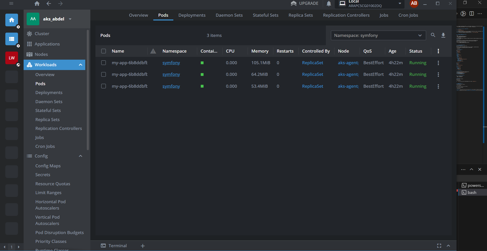
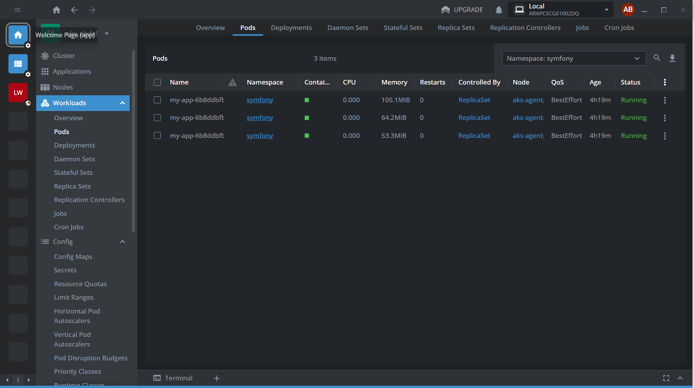
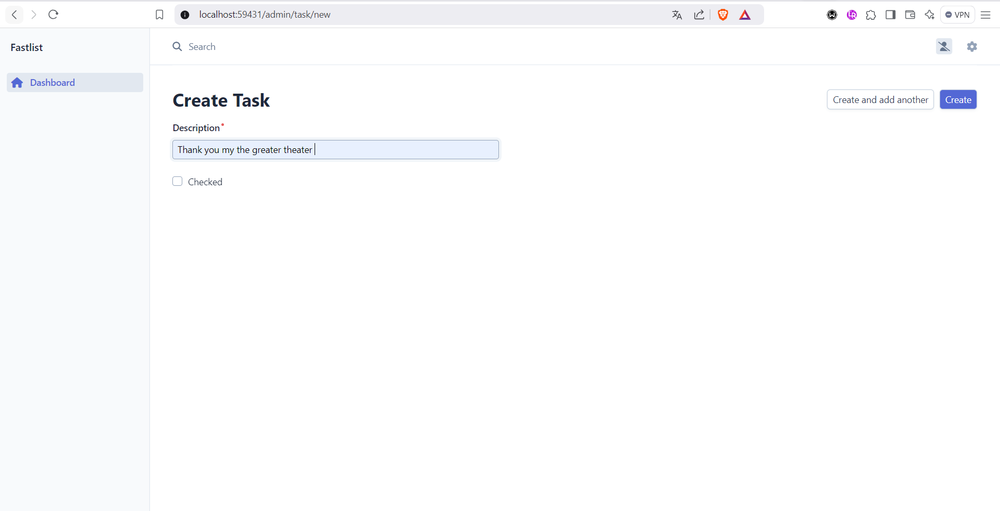

Documentation:  déployer une application Symfony à l'aide de Docker, Docker Hub, et un cluster AKS (Azure Kubernetes Service). Voici quelques points importants à vérifier ou à améliorer à chaque étape :

---

### **Étape 1 : Construire et exécuter l'image Docker**
```bash
docker build -t symfony_app .
docker run -d -p 8080:80 symfony_app
```
- **Conseil :** Assurez-vous que votre `Dockerfile` est correctement configuré pour copier le code Symfony, installer les dépendances et configurer le serveur (par ex., Apache ou Nginx).
- **Test local :** Vérifiez que l'application fonctionne en accédant à `http://localhost:8080`.

---

### **Étape 2 : Publier l'image sur Docker Hub**
1. **Connexion et création de repo :**
   ```bash
   docker login
   docker build -t abdelbagui/symfony_app:latest .
   docker push abdelbagui/symfony_app:latest
   ```
   
   - **Conseil :** Si votre image est volumineuse, envisagez d'utiliser des étapes multistages dans votre `Dockerfile` pour réduire sa taille.

2. **Vérifications :**
   - Une fois l'image poussée, assurez-vous qu'elle est visible dans votre compte Docker Hub.
   - Téléchargez-la sur une autre machine pour valider que tout fonctionne correctement :
     ```bash
     docker pull abdelbagui/symfony_app:latest
     docker run -d -p 8080:80 abdelbagui/symfony_app:latest
     ```

---

### **Étape 3 : Créer et configurer AKS**
1. **Création du cluster AKS :**
   - Utilisez Azure CLI pour créer un cluster AKS :
     ```bash
     az aks create -g <resource-group-name> -n <cluster-name> --node-count 1 --generate-ssh-keys
     az aks get-credentials -g <resource-group-name> -n <cluster-name>
     ```


2. **Créer les fichiers YAML :**
   - **`deployment.yml`:**
     ```yaml
     apiVersion: apps/v1
     kind: Deployment
     metadata:
       name: symfony-app
     spec:
       replicas: 3
       selector:
         matchLabels:
           app: symfony-app
       template:
         metadata:
           labels:
             app: symfony-app
         spec:
           containers:
           - name: symfony-app
             image: abdelbagui/symfony_app:latest
             ports:
             - containerPort: 80
           imagePullSecrets:
           - name: my-docker-secret
     ```

   - **`service.yml`:**
     ```yaml
     apiVersion: v1
     kind: Service
     metadata:
       name: symfony-app-service
     spec:
       selector:
         app: symfony-app
       ports:
         - protocol: TCP
           port: 80
           targetPort: 80
       type: LoadBalancer
     ```

3. **Créer un secret Docker :**
   ```bash
   kubectl create secret docker-registry my-docker-secret \
     --docker-server=https://index.docker.io/v1/ \
     --docker-username=abdelbagui \
     --docker-password=password_dockerHub \
     --docker-email=a07abdel@gmail.com
   ```

4. **Déployer les ressources sur AKS :**
   ```bash
   kubectl apply -f deployment.yml
   kubectl apply -f service.yml
   ```

5. **Vérifications :**
   - Vérifiez les pods et services :
     ```bash
     kubectl get pods
     kubectl get services
     ```
   - Accédez à l'URL du service (générée automatiquement pour les types `LoadBalancer`).

---

### **Conseils supplémentaires :**
- **Logs et débogage :**
  - Si un pod ne fonctionne pas, utilisez :
    ```bash
    kubectl logs <pod-name>
    ```
  - Pour des informations détaillées sur les erreurs :
    ```bash
    kubectl describe pod <pod-name>
    ```

voici notre Application

- **Automatisation :** Vous pouvez utiliser des outils comme **Helm** pour simplifier la gestion des configurations YAML.

- **Surveillance :** Configurez des outils comme **Prometheus** ou **Azure Monitor** pour suivre les performances de votre cluster.

